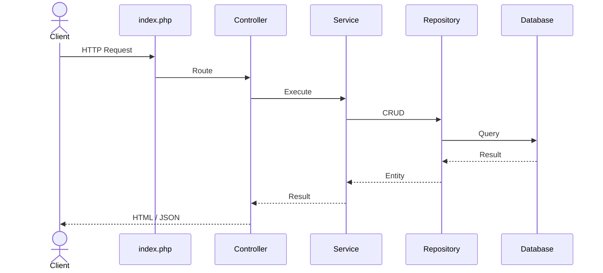

# Ghost PHP

## 1. Overview（概要）

- **Ghost PHP** は、私が開発したプライベートな PHP フレームワークです。
- [ドキュメントはこちら / You can find the documentation here](https://sh-revue.net/projects/ghostphp)

## 2. Architecture（アーキテクチャ）



### ■ Layer Responsibilities
- index.php
  - アプリケーションのエントリーポイント。
  - bootstrap.php を読み込み、アプリケーションを初期化する。
  - ルーティングを定義し、HTTPリクエストを処理する。
  - The application's entry point. Loads `bootstrap.php`, initializes the application, defines routes, and dispatches incoming HTTP requests.
  - 
- Router
  - HTTPリクエストを対応する Controller に振り分ける。
  - Routes incoming HTTP requests to controllers.

- Controller
  - HTTPリクエストを受け取り、Service を呼び出す。
  - 必要に応じて Response を返す。
  - ビジネスロジックは持たず、各レイヤーの橋渡しを担当する。
  - Receives HTTP requests, delegates processing to services, and returns the appropriate response while remaining free of business logic.

- HttpRequest
  - 入力データの検証・整形
  - Validation / Data shaping

- Service
  - ユースケース単位のビジネスロジック
  - Repository を通じてデータを取得・保存
  - Implements business logic and coordinates data access through repositories.

- Response
  - Service の返したデータを最終形式（JSON / HTML）に変換
  - Transforms service results into JSON or HTML responses.

- Repository
  - データアクセス（CRUD）をカプセル化
  - Entity を用いてDBとデータをやり取りする
  - Encapsulates data access and persists entities.

- Entity
  - データベースとやり取りするデータ構造

### ■ Thin Framework Philosophy

Ghost PHP は Thin Framework を志向しています。

最小限の構造のみを提供しつつ、強いレイヤー分離と拡張前提の設計を採用しています。

従来の開発現場では、Controller と Service の両方にロジックが分散し、責務が曖昧になるケースが見られることがありました。Ghost PHP ではこの構造を整理し、ビジネスロジックを Service に集約することで、責務の明確化や可読性の向上を目指しました。

また現代の開発環境では、AIによるコード生成、ライブラリ選定の高速化、開発スタイルの多様化が進んでいます。

そのため Ghost PHP は、すべてを内包するフレームワークではなく、拡張可能な最小限の基盤を提供することを目的としています。


## 3. Directory（ディレクトリ構成）

```txt
├─aura
│  ├─database       // DB接続
│  ├─https          // リクエスト・レスポンス管理
│  ├─routes         // ルーティング
│  └─utils
│      ├─commands    // CLIコマンド処理
│      └─functions   // 主にView用関数
├─config             // 設定ファイル
├─controllers        // コントローラークラス
├─requests           // フォームデータ管理クラス
├─interfaces         // 各種インターフェース
├─logs               // ログ
├─migrations         // マイグレーション
│  ├─csv
│  ├─migrate
│  └─seed
├─entities
├─repositories
├─public             // 公開用アセット
│  └─assets
│      ├─css
│      ├─img
│      └─js
├─services           // サービス層
├─storage            // 一時ファイルなど
│  ├─csv
│  └─doc
└─templates          // テンプレート
    ├─errors         // エラーページ
    └─layouts        // ヘッダー・フッター
```

## 4. Dependencies
- guzzlehttp/guzzle
- vlucas/phpdotenv
- phpunit/phpunit
- phpmailer/phpmailer
  
## 5. Set up（セットアップ）

### ■ プロジェクトのクローンと依存パッケージのインストール / Clone & Install

```bash
git clone https://github.com/sh-kikuchi/GhostPHP.git
cd GhostPHP
composer install
```

### ■ データベース接続設定 / Connect Database

- プロジェクト直下に `.env` ファイルを作成し、以下のように設定してください:

```env
DB_HOST = 'localhost'
DB_NAME = 'test'
DB_USER = 'root'
DB_PASS = ''
PASSWORD = 'password'
```

### ■ マイグレーションとシーディング / Migration & Seeding

- テーブルを作成します:

```bash
php ghost migrate
```

- テーブルに初期データを挿入します:

```bash
php ghost seed
```

### ■ CSVによるデータのインポート・エクスポート / CSV Import & Export

#### インポート（例：usersテーブル）

`Storage/csv` に `users.csv` を配置し、以下を実行:

```bash
php ghost importCSV users
```

#### エクスポート（例：postsテーブル）

```bash
php ghost exportCSV posts
```

### ■ メール設定
- Ghost PHP はデフォルトで SMTP によるメール送信に対応しています。
- 開発環境では smtp4dev を使用し、ローカルでメール送信をエミュレートする構成を推奨しています（事前セットアップが必要です）。
- .env に以下の設定を記述してください。

```
MB_LANGUAGE=Japanese
MB_INTERNAL_ENCODING=UTF-8

SMTP_HOST=localhost
SMTP_PORT=2525

SMTP_USER=
SMTP_PASS=

SMTP_AUTH=false
SMTP_SECURE=false

MAIL_FROM=test@example.com
```